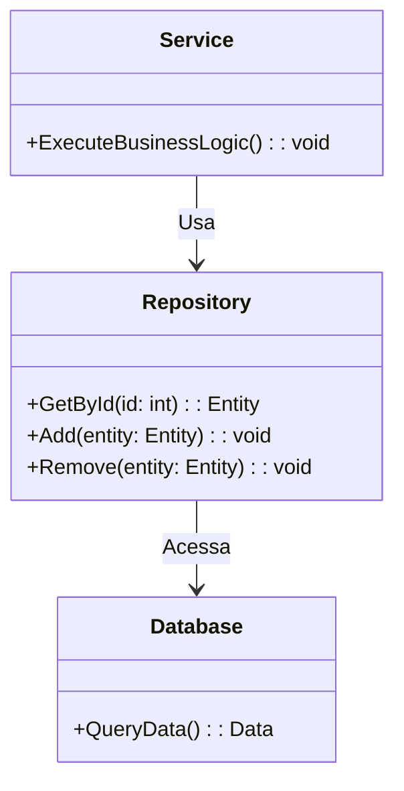
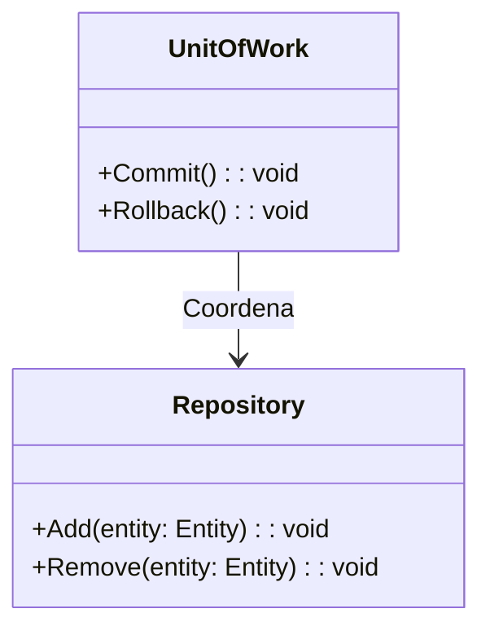
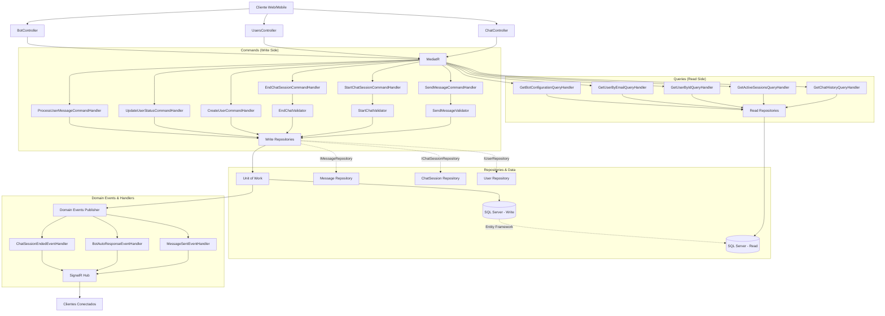
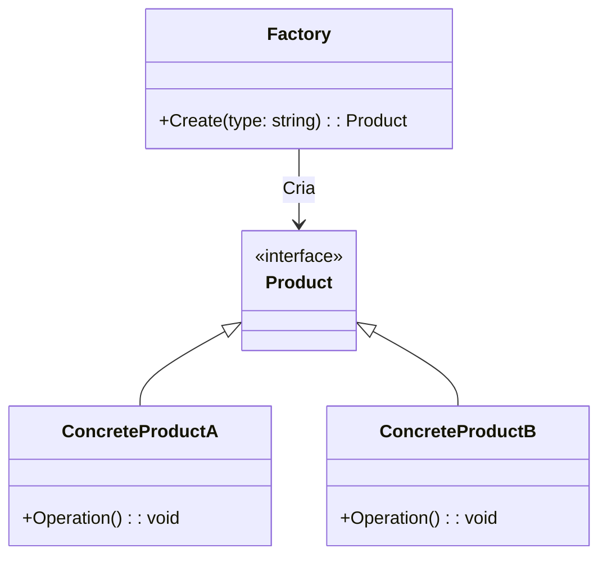
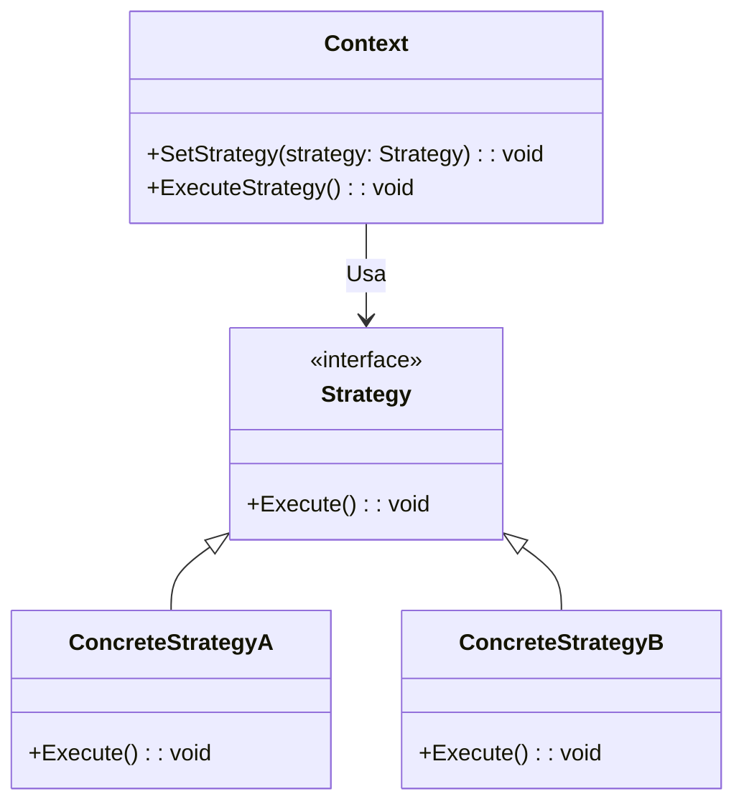
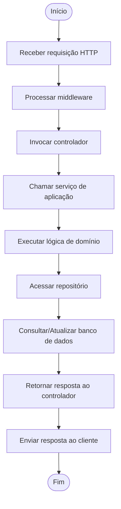
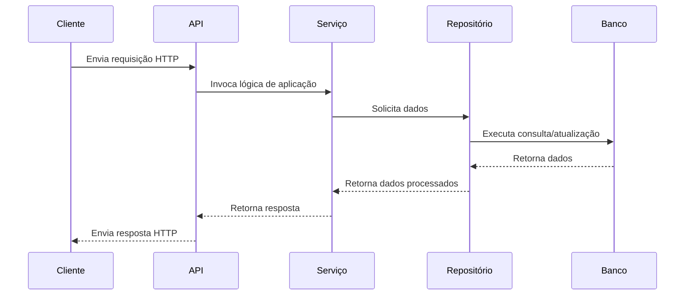

# Documentação do Back-End

## Introdução

Este documento descreve a construção e o funcionamento do back-end do projeto, detalhando as tecnologias utilizadas, as decisões arquiteturais e as abordagens adotadas. O objetivo é fornecer uma visão clara e abrangente do back-end para desenvolvedores e stakeholders.

---

## Arquitetura do Back-End

O back-end foi desenvolvido utilizando a linguagem **C#** e o framework **ASP.NET Core**, seguindo princípios de arquitetura limpa e boas práticas de desenvolvimento. A escolha dessas tecnologias foi motivada pelos seguintes fatores:

- **Desempenho**: O ASP.NET Core é altamente otimizado para aplicações web modernas.
- **Escalabilidade**: Suporte nativo para arquiteturas baseadas em microsserviços.
- **Ecosistema Rico**: Integração com ferramentas como Entity Framework Core para acesso a dados e SignalR para comunicação em tempo real.

### Estrutura de Pastas

A estrutura do back-end está organizada da seguinte forma:

```plaintext
BackEnd/
├── src/
│   ├── ChatBot.Api/          # Projeto principal da API
│   ├── ChatBot.Application/  # Camada de aplicação
│   ├── ChatBot.Domain/       # Camada de domínio
│   ├── ChatBot.Infrastructure/ # Camada de infraestrutura
│   ├── ChatBot.Shared/       # Recursos compartilhados
├── tests/
│   ├── ChatBot.UnitTests/    # Testes unitários
```

- **`ChatBot.Api/`**: Contém os controladores e a configuração inicial da API.
- **`ChatBot.Application/`**: Implementa os casos de uso e a lógica de aplicação.
- **`ChatBot.Domain/`**: Define as entidades, interfaces e regras de negócio.
- **`ChatBot.Infrastructure/`**: Gerencia a persistência de dados e integrações externas.
- **`ChatBot.Shared/`**: Contém recursos reutilizáveis, como DTOs e constantes.

---

## Tecnologias Utilizadas

### **ASP.NET Core**

Framework para construção de APIs robustas e escaláveis. Ele oferece:

- **Middleware**: Pipeline configurável para manipulação de requisições e respostas.
- **Injeção de Dependência**: Suporte nativo para IoC (Inversão de Controle).
- **Roteamento**: Sistema flexível para definição de endpoints.

### **Entity Framework Core**

Utilizado para mapeamento objeto-relacional (ORM), simplificando o acesso ao banco de dados. Principais vantagens:

- **Migrations**: Controle de versões do esquema do banco de dados.
- **Consultas LINQ**: Escrita de consultas de forma declarativa e tipada.

### **SignalR**

Biblioteca para comunicação em tempo real entre cliente e servidor. Ideal para:

- **Notificações em Tempo Real**: Atualizações instantâneas para os usuários.
- **Chats**: Comunicação bidirecional eficiente.

### Comunicação com SignalR

O **SignalR** é utilizado no back-end para gerenciar a comunicação em tempo real entre o servidor e os clientes conectados. Ele é ideal para cenários onde atualizações instantâneas são necessárias, como chats, notificações e dashboards.

#### Como Funciona

1. **Hub**: O SignalR utiliza hubs para gerenciar a comunicação. Um hub é uma classe no servidor que atua como um ponto central para enviar e receber mensagens.
2. **Conexão**: Os clientes estabelecem uma conexão persistente com o hub.
3. **Métodos do Hub**: O servidor define métodos no hub que podem ser chamados pelos clientes.
4. **Chamadas de Cliente**: O servidor também pode chamar métodos nos clientes conectados.

#### Benefícios

- **Comunicação Bidirecional**: Permite que o servidor envie mensagens para os clientes sem que eles precisem solicitar.
- **Escalabilidade**: Suporte para balanceamento de carga e múltiplos servidores.
- **Transparência de Transporte**: Escolhe automaticamente o melhor transporte disponível (WebSockets, Server-Sent Events ou Long Polling).

#### Exemplo de Uso no Back-End

No contexto do chat, o SignalR é utilizado para:

- Enviar mensagens para todos os participantes conectados.
- Notificar os clientes sobre novos usuários que entraram no chat.
- Atualizar a interface do usuário em tempo real com eventos importantes.

---

## Padrões de Projeto Utilizados

### **Repository Pattern**

O **Repository Pattern** é utilizado para abstrair o acesso ao banco de dados, permitindo que a lógica de negócio não dependa diretamente da implementação de persistência. Ele atua como uma camada intermediária entre a aplicação e o banco de dados.

#### Benefícios do Repository Pattern

- Facilita a substituição do mecanismo de persistência sem alterar a lógica de negócio.
- Promove a separação de responsabilidades, seguindo o princípio SOLID.

#### Diagrama do Repository Pattern



### **Unit of Work**

O **Unit of Work** é utilizado para garantir que múltiplas operações de banco de dados sejam tratadas como uma única transação. Ele coordena as mudanças feitas por diferentes repositórios e assegura que todas sejam aplicadas ou revertidas juntas.

#### Benefícios do Unit of Work

- Evita inconsistências no banco de dados em caso de falhas.
- Centraliza o gerenciamento de transações.

#### Diagrama do Unit of Work



### **CQRS (Command Query Responsibility Segregation)**

O **CQRS** separa as operações de leitura e escrita em diferentes modelos, otimizando o desempenho e a escalabilidade. Enquanto os comandos (writes) alteram o estado do sistema, as consultas (queries) apenas leem os dados.

#### Benefícios do CQRS

- Permite otimizações específicas para leitura e escrita.
- Facilita a escalabilidade horizontal.

#### Diagrama do CQRS



### **Factory Pattern**

O **Factory Pattern** é utilizado para centralizar a criação de objetos complexos, promovendo reutilização e flexibilidade. Ele encapsula a lógica de criação em um único local, facilitando alterações futuras.

#### Benefícios do Factory Pattern

- Reduz a duplicação de código ao criar objetos.
- Facilita a aplicação de lógica condicional na criação de instâncias.

#### Diagrama do Factory Pattern



### **Strategy Pattern**

O **Strategy Pattern** é utilizado para definir uma família de algoritmos, encapsulá-los e torná-los intercambiáveis. Ele permite que o algoritmo varie independentemente dos clientes que o utilizam.

#### Benefícios do Strategy Pattern

- Facilita a adição de novos algoritmos sem alterar o código existente.
- Promove o princípio de aberto/fechado (Open/Closed Principle) do SOLID.
- Reduz a complexidade do código ao evitar condicionais extensos para seleção de algoritmos.

#### Diagrama do Strategy Pattern



#### Exemplo de Uso

Imagine um sistema de cálculo de frete que precisa suportar diferentes estratégias de cálculo, como frete expresso, econômico e internacional. O Strategy Pattern permite encapsular cada cálculo em uma classe separada, tornando o sistema flexível para adicionar ou modificar estratégias no futuro.

---

Esses padrões de projeto foram escolhidos para garantir modularidade, escalabilidade e facilidade de manutenção no desenvolvimento do back-end. Cada padrão desempenha um papel específico na arquitetura, contribuindo para a robustez e flexibilidade do sistema.

## Fluxo de Funcionamento

### Diagrama de Atividade



### Diagrama de Sequência



---

## Tabelas de Referência

### Principais Dependências

| Dependência            | Versão   | Descrição                          |
|------------------------|----------|------------------------------------|
| ASP.NET Core           | 7.x      | Framework para construção de APIs |
| Entity Framework Core  | 7.x      | ORM para acesso a dados           |
| SignalR                | 7.x      | Comunicação em tempo real         |

---

## Conclusão

O back-end foi projetado para ser modular, escalável e fácil de manter. As tecnologias e padrões de projeto escolhidos garantem uma base sólida para o desenvolvimento e evolução do sistema.

Para dúvidas ou contribuições, consulte a equipe de desenvolvimento.
