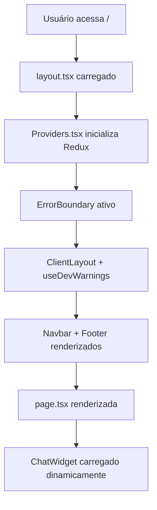
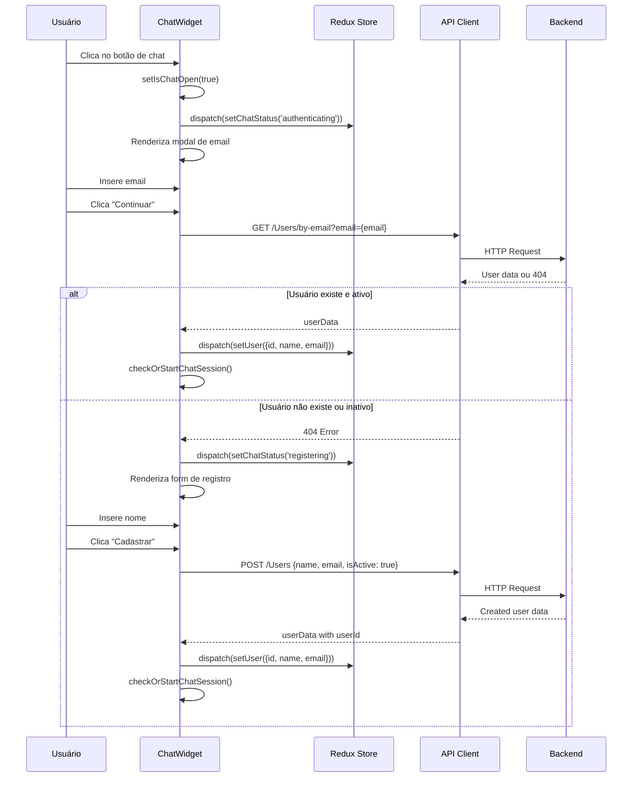
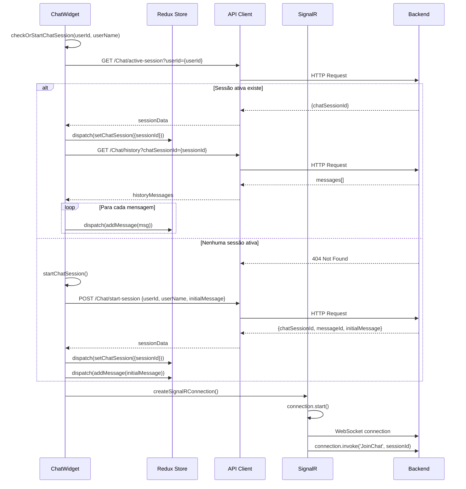
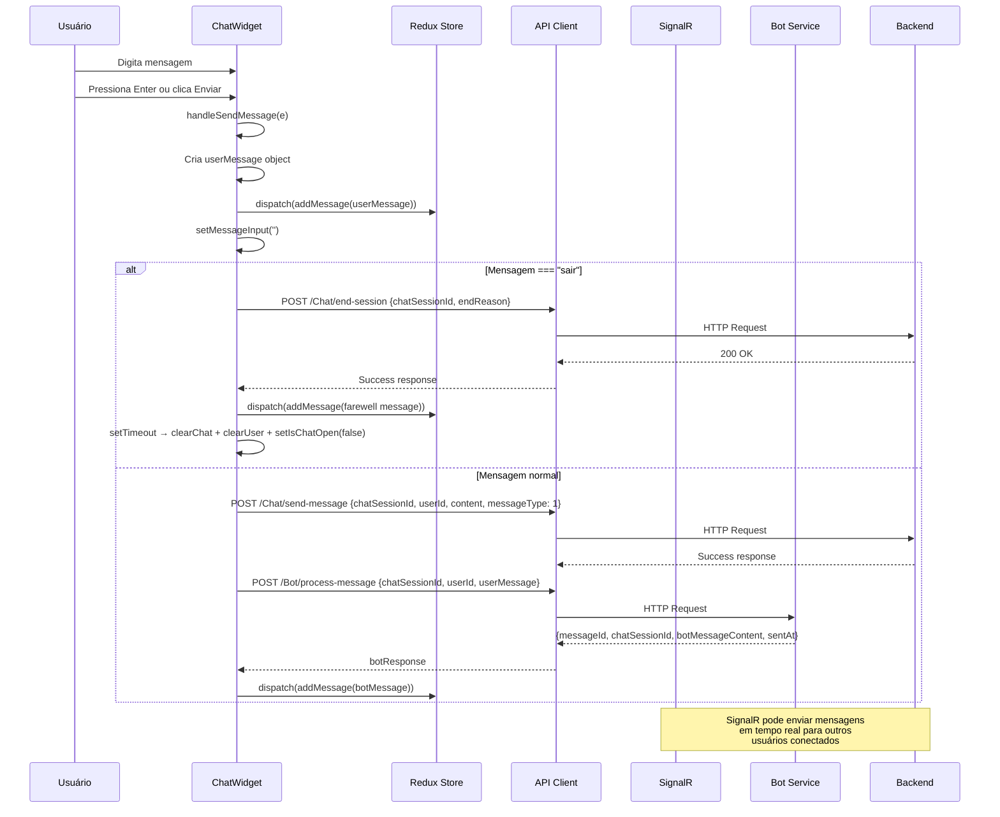

# Arquitetura e Fluxo da Aplicação ChatBot F1

## 📋 Visão Geral

Este documento detalha **cada arquivo TypeScript e TypeScript React** da aplicação, explicando suas funções, padrões de projeto utilizados e o **fluxo completo de execução** desde a ação do usuário até a resposta da API e renderização.

---

## 🏗️ Padrões de Projeto Utilizados

### 1. **Component-Based Architecture** (React)
- **Motivo**: Facilita reutilização, manutenção e testabilidade
- **Implementação**: Componentes isolados com responsabilidades específicas

### 2. **Redux Toolkit Pattern** (Estado Global)
- **Motivo**: Gerenciamento consistente de estado complexo e comunicação entre componentes
- **Implementação**: Slices com actions e reducers tipados

### 3. **Provider Pattern** (Injeção de Dependência)
- **Motivo**: Fornece contexto global sem prop drilling
- **Implementação**: Redux Provider envolvendo toda a aplicação

### 4. **Error Boundary Pattern** (Tratamento de Erros)
- **Motivo**: Captura erros de forma graceful sem quebrar toda a aplicação
- **Implementação**: Classe component que intercepta erros dos filhos

### 5. **Singleton Pattern** (API Client)
- **Motivo**: Uma única instância de configuração HTTP para toda a aplicação
- **Implementação**: Instância única do Axios com interceptors globais

### 6. **Observer Pattern** (SignalR)
- **Motivo**: Comunicação em tempo real bidirecional
- **Implementação**: Hub connection com event listeners

### 7. **Dynamic Import Pattern** (Code Splitting)
- **Motivo**: Otimização de performance com carregamento sob demanda
- **Implementação**: Dynamic imports para componentes não-críticos

---

## 📁 Estrutura de Arquivos e Análise Detalhada

### 🚀 **1. Configuração e Inicialização**

#### `package.json`
```json
{
  "name": "chatbot-f1",
  "version": "0.1.0",
  "dependencies": {
    "@microsoft/signalr": "^8.0.0",
    "@reduxjs/toolkit": "^2.8.2",
    "axios": "^1.7.2",
    "next": "^14.2.31"
  }
}
```
- **Função**: Gerencia dependências e scripts do projeto
- **Dependências Principais**:
  - `@microsoft/signalr`: Comunicação em tempo real
  - `@reduxjs/toolkit`: Estado global
  - `axios`: Cliente HTTP
  - `next`: Framework React

---

### 🎯 **2. Entrada da Aplicação (App Router Next.js)**

#### `src/app/layout.tsx`
```tsx
export default function RootLayout({ children }: { children: React.ReactNode }) {
  return (
    <html lang="pt-BR">
      <body className={inter.className} suppressHydrationWarning={true}>
        <ErrorBoundary>
          <Providers>
            <ClientLayout>
              <Navbar />
              <main className="pt-16 min-h-screen">{children}</main>
              <Footer />
              <ChatWidget />
            </ClientLayout>
          </Providers>
        </ErrorBoundary>
      </body>
    </html>
  );
}
```
- **Função**: Layout global da aplicação (Root Layout)
- **Responsabilidades**:
  - Define metadados SEO e ícones
  - Configura fonte Inter
  - Estabelece hierarquia de providers
  - Carrega `ChatWidget` dinamicamente (SSR false)
- **Padrão**: Layout Pattern + Error Boundary Pattern

#### `src/app/providers.tsx`
```tsx
'use client';
export function Providers({ children }: { children: React.ReactNode }) {
  return <Provider store={store}>{children}</Provider>;
}
```
- **Função**: Provedor global do Redux
- **Responsabilidades**: Injeta store Redux em toda árvore de componentes
- **Padrão**: Provider Pattern

#### `src/app/page.tsx`
```tsx
export default function Home() {
  return (
    <div className="container mx-auto px-4 py-8">
      <h1 className="text-4xl font-bold mb-4">Vladimir</h1>
      <p>Clique no ícone de chat no canto inferior direito para começar uma conversa.</p>
    </div>
  );
}
```
- **Função**: Página inicial (route `/`)
- **Responsabilidades**: Apresenta aplicação e instrui usuário a usar o chat

#### `src/app/contact/page.tsx`
```tsx
export default function Contact() {
  return (
    <div className="container mx-auto px-4 py-8">
      <h1>Entre em Contato!</h1>
      <p>Nome: Vladimir Carlos Alves</p>
      <p>WhatsApp: +55 (35) 92001-4611</p>
    </div>
  );
}
```
- **Função**: Página de contato (route `/contact`)
- **Responsabilidades**: Exibe informações de contato do desenvolvedor

---

### 🧩 **3. Componentes da Interface**

#### `src/components/ErrorBoundary.tsx`
```tsx
class ErrorBoundary extends React.Component<ErrorBoundaryProps, ErrorBoundaryState> {
  static getDerivedStateFromError(error: Error): ErrorBoundaryState {
    return { hasError: true, error };
  }

  componentDidCatch(error: Error, errorInfo: React.ErrorInfo) {
    console.error('ErrorBoundary capturou um erro:', error, errorInfo);
  }
}
```
- **Função**: Captura erros de renderização React
- **Responsabilidades**:
  - Intercepta erros em componentes filhos
  - Exibe UI de fallback amigável
  - Mostra detalhes técnicos em development
  - Permite recarregar página
- **Padrão**: Error Boundary Pattern (Class Component)

#### `src/components/Navbar.tsx`
```tsx
'use client';
export default function Navbar() {
  const pathname = usePathname();
  return (
    <nav className="bg-red-600 text-white p-4 fixed w-full top-0 z-50">
      <Link href="/">Vladimir</Link>
      {/* Navigation links */}
    </nav>
  );
}
```
- **Função**: Barra de navegação global
- **Responsabilidades**:
  - Links de navegação (Home, Contato)
  - Indicação visual da página ativa
  - Layout fixo no topo
- **Padrão**: Presentational Component

#### `src/components/Footer.tsx`
```tsx
export default function Footer() {
  return (
    <footer className="bg-black text-white p-4 text-center fixed w-full bottom-0 z-50">
      <p>Desenvolvido por Vladimir Carlos Alves</p>
    </footer>
  );
}
```
- **Função**: Rodapé global
- **Responsabilidades**: Informações do desenvolvedor
- **Padrão**: Presentational Component

#### `src/components/ClientLayout.tsx`
```tsx
'use client';
export default function ClientLayout({ children }: { children: React.ReactNode }) {
  useDevWarnings();
  return <>{children}</>;
}
```
- **Função**: Layout específico do cliente
- **Responsabilidades**: Executa hooks de desenvolvimento
- **Padrão**: Higher-Order Component (HOC)

---

### 💬 **4. Sistema de Chat (Componente Principal)**

#### `src/components/ChatWidget.tsx`
- **Função**: Componente principal do sistema de chat
- **Responsabilidades Complexas**:

##### **Estado Local e Refs**:
```tsx
const [isChatOpen, setIsChatOpen] = useState(false);
const [emailInput, setEmailInput] = useState('');
const [messageInput, setMessageInput] = useState('');
const connectionRef = useRef<signalR.HubConnection | null>(null);
```

##### **Estado Global (Redux)**:
```tsx
const { id: userId, name: userName, isAuthenticated } = useAppSelector((state) => state.user);
const { sessionId, messages, status, error } = useAppSelector((state) => state.chat);
```

##### **Padrões Implementados**:
- **State Management Pattern**: Combinação estado local + global
- **Ref Pattern**: Persistência de conexão SignalR
- **Effect Pattern**: Múltiplos useEffect para diferentes responsabilidades

---

### 📊 **5. Gerenciamento de Estado (Redux Toolkit)**

#### `src/store/store.ts`
```tsx
// User Slice
const userSlice = createSlice({
  name: 'user',
  initialState: { id: null, name: null, email: null, isAuthenticated: false },
  reducers: {
    setUser: (state, action) => { /* atualiza dados do usuário */ },
    clearUser: (state) => { /* limpa dados do usuário */ }
  }
});

// Chat Slice
const chatSlice = createSlice({
  name: 'chat',
  initialState: { sessionId: null, messages: [], status: 'closed', error: null },
  reducers: {
    setChatSession: (state, action) => { /* define sessão ativa */ },
    addMessage: (state, action) => { /* adiciona mensagem */ },
    setChatStatus: (state, action) => { /* atualiza status */ }
  }
});

export const store = configureStore({
  reducer: { user: userSlice.reducer, chat: chatSlice.reducer }
});
```
- **Função**: Estado global centralizado
- **Responsabilidades**:
  - Gerencia dados do usuário (id, nome, email, autenticação)
  - Gerencia estado do chat (sessão, mensagens, status, erros)
  - Fornece actions tipadas e selectors
- **Padrões**: 
  - **Redux Pattern**: Flux architecture
  - **Slice Pattern**: Redux Toolkit
  - **TypeScript Integration**: Tipagem forte

---

### 🌐 **6. Comunicação com Backend**

#### `src/lib/api.ts`
```tsx
const apiClient = axios.create({
  baseURL: API_URL,
  timeout: 10000,
  headers: { 'Content-Type': 'application/json' }
});

apiClient.interceptors.request.use((config) => {
  console.log(`🚀 API Request: ${config.method?.toUpperCase()} ${config.url}`);
  return config;
});

apiClient.interceptors.response.use(
  (response) => {
    console.log(`✅ API Response: ${response.status} ${response.config.url}`);
    return response;
  },
  (error) => {
    console.error('❌ Response Error:', error.response?.data);
    return Promise.reject(error);
  }
);
```
- **Função**: Cliente HTTP configurado
- **Responsabilidades**:
  - Configuração base para todas requisições
  - Logging automático de requests/responses
  - Tratamento global de erros
  - Suporte HTTPS para desenvolvimento
- **Padrão**: Singleton Pattern + Interceptor Pattern

#### `src/lib/signalr.ts`
```tsx
export const createSignalRConnection = () => {
  const connection = new signalR.HubConnectionBuilder()
    .withUrl(SIGNALR_HUB_URL, {
      transport: signalR.HttpTransportType.WebSockets
    })
    .withAutomaticReconnect([0, 2000, 10000, 30000])
    .configureLogging(signalR.LogLevel.Information)
    .build();

  connection.onreconnecting((error) => console.log('🔄 SignalR reconectando...'));
  connection.onreconnected((connectionId) => console.log('✅ SignalR reconectado!'));

  return connection;
};
```
- **Função**: Factory para conexões SignalR
- **Responsabilidades**:
  - Configuração de WebSocket
  - Auto-reconexão com backoff strategy
  - Logging de eventos de conexão
- **Padrão**: Factory Pattern + Observer Pattern

---

### 🔧 **7. Utilitários e Hooks**

#### `src/lib/utils.ts`
```tsx
import { clsx, type ClassValue } from "clsx"
import { twMerge } from "tailwind-merge"

export function cn(...inputs: ClassValue[]) {
  return twMerge(clsx(inputs))
}
```
- **Função**: Utilitário para combinação de classes CSS
- **Responsabilidades**: Merge inteligente de classes Tailwind
- **Padrão**: Utility Functions

#### `src/hooks/useDevWarnings.ts`
```tsx
export const useDevWarnings = () => {
  useEffect(() => {
    if (process.env.NODE_ENV === 'development') {
      // Suprime warnings específicos do desenvolvimento
      console.warn = (...args) => {
        const message = args.join(' ');
        const shouldSuppress = suppressWarnings.some(warning => message.includes(warning));
        if (!shouldSuppress) originalWarn(...args);
      };
    }
  }, []);
};
```
- **Função**: Hook para filtrar warnings de desenvolvimento
- **Responsabilidades**: Melhora experiência de desenvolvimento
- **Padrão**: Custom Hook Pattern

---

### 🎨 **8. Componentes UI (shadcn/ui)**

#### `src/components/ui/button.tsx`
```tsx
const buttonVariants = cva(
  "inline-flex items-center justify-center gap-2 whitespace-nowrap rounded-md text-sm font-medium transition-colors",
  {
    variants: {
      variant: { default: "bg-primary text-primary-foreground", destructive: "bg-destructive" },
      size: { default: "h-9 px-4 py-2", sm: "h-8 rounded-md px-3 text-xs" }
    }
  }
);

const Button = React.forwardRef<HTMLButtonElement, ButtonProps>(
  ({ className, variant, size, asChild = false, ...props }, ref) => {
    const Comp = asChild ? Slot : "button";
    return <Comp className={cn(buttonVariants({ variant, size, className }))} ref={ref} {...props} />;
  }
);
```
- **Função**: Componente Button reutilizável
- **Responsabilidades**: Variantes visuais e comportamentais
- **Padrões**: 
  - **Compound Component Pattern**: Variants com CVA
  - **Render Props Pattern**: asChild prop com Slot
  - **Forward Ref Pattern**: Ref forwarding

#### `src/components/ui/dialog.tsx`
- **Função**: Sistema de modais/dialogs
- **Responsabilidades**: Base para o modal de chat
- **Padrão**: Compound Component Pattern (múltiplos componentes relacionados)

#### `src/components/ui/input.tsx`
- **Função**: Componente Input reutilizável
- **Responsabilidades**: Inputs padronizados com estilos consistentes
- **Padrão**: Forward Ref Pattern

---

## 🔄 **Fluxo Completo de Execução**

### **1. 🚀 Inicialização da Aplicação**



**Sequência Detalhada**:
1. **Next.js Router** resolve rota `/`
2. **`layout.tsx`** define estrutura HTML base
3. **`providers.tsx`** injeta Redux store
4. **`ErrorBoundary`** envolve aplicação para captura de erros
5. **`ClientLayout`** executa `useDevWarnings` hook
6. **Componentes globais** (Navbar, Footer) são renderizados
7. **`page.tsx`** renderiza conteúdo da página inicial
8. **`ChatWidget`** é carregado com dynamic import (não-blocking)

---

### **2. 💬 Fluxo de Autenticação do Chat**



**Detalhamento do Processo**:

#### **2.1 Ação: Usuário clica no botão de chat**
- **Componente**: `ChatWidget.tsx` função `handleOpenChat()`
- **Estado alterado**: `isChatOpen = true`
- **Redux dispatch**: `setChatStatus('authenticating')`

#### **2.2 Verificação de Email**
- **API Call**: `GET /Users/by-email?email={email}`
- **Interceptor Request**: Logs automáticos da requisição
- **Interceptor Response**: Logs da resposta + tratamento de erro

#### **2.3 Cenário: Usuário Existe e Ativo**
- **Redux dispatch**: `setUser({id, name, email})`
- **Estado user.isAuthenticated**: `true`
- **Próximo passo**: `checkOrStartChatSession()`

#### **2.4 Cenário: Usuário Não Existe/Inativo**
- **Redux dispatch**: `setChatStatus('registering')`
- **Render condicional**: Form de registro exibido
- **API Call adicional**: `POST /Users` para criar usuário

---

### **3. 🎮 Fluxo de Sessão de Chat**



**Detalhamento**:

#### **3.1 Função: `checkOrStartChatSession()`**
- **Validação**: Verifica se `userId` é válido
- **Tentativa 1**: Busca sessão ativa existente
- **Fallback**: Se não existe, cria nova sessão

#### **3.2 Recuperação de Histórico**
- **API Call**: `GET /Chat/history?chatSessionId={sessionId}`
- **Processamento**: Loop através das mensagens
- **Redux**: Cada mensagem é adicionada via `addMessage()`

#### **3.3 Conexão SignalR**
- **Factory**: `createSignalRConnection()` cria nova instância
- **Configuração**: WebSockets + auto-reconnect + logging
- **Event Listeners**:
  - `ReceiveMessage`: Adiciona mensagem via Redux
  - `ChatSessionEnded`: Limpa estado e fecha chat

---

### **4. 📨 Fluxo de Envio de Mensagem**



**Detalhamento**:

#### **4.1 Captura de Input**
- **Event**: `onSubmit` do form ou `onKeyPress` Enter
- **Validação**: Verifica se mensagem não está vazia
- **Estado**: Limpa input imediatamente para UX responsiva

#### **4.2 Processamento Local**
- **Objeto Message**: Criado com `crypto.randomUUID()`
- **Redux Dispatch**: Mensagem adicionada imediatamente (UI optimista)
- **Input Reset**: Campo limpo para próxima mensagem

#### **4.3 Comando Especial "sair"**
- **Detecção**: `messageInput.toLowerCase().trim() === 'sair'`
- **API Call**: `POST /Chat/end-session`
- **Cleanup**: Timer de 1.5s para mostrar mensagem de despedida
- **Estado**: Limpa Redux + fecha modal

#### **4.4 Mensagem Normal**
- **API Call 1**: `POST /Chat/send-message` (salva mensagem)
- **API Call 2**: `POST /Bot/process-message` (processa resposta do bot)
- **Bot Response**: Adicionada via Redux com `isFromBot: true`

---

### **5. 🔄 Fluxo de Comunicação em Tempo Real (SignalR)**

```mermaid
graph TD
    A[SignalR Connection Created] --> B[connection.start()]
    B --> C[connection.invoke('JoinChat', sessionId)]
    C --> D[Listen: 'ReceiveMessage']
    C --> E[Listen: 'ChatSessionEnded']
    
    F[Mensagem enviada por outro usuário] --> G[Backend emite 'ReceiveMessage']
    G --> H[ChatWidget recebe evento]
    H --> I[dispatch(addMessage(receivedMessage))]
    
    J[Sessão encerrada pelo admin] --> K[Backend emite 'ChatSessionEnded']
    K --> L[ChatWidget recebe evento]
    L --> M[dispatch(clearChat + clearUser)]
    M --> N[setIsChatOpen(false)]
```

**Event Handlers SignalR**:

#### **5.1 `ReceiveMessage` Event**
```tsx
newConnection.on('ReceiveMessage', (message: Message) => {
  dispatch(addMessage(message));
});
```
- **Trigger**: Quando alguém envia mensagem na mesma sessão
- **Ação**: Adiciona mensagem em tempo real ao estado

#### **5.2 `ChatSessionEnded` Event**
```tsx
newConnection.on('ChatSessionEnded', (data: { chatSessionId: string; reason: string }) => {
  dispatch(addMessage({
    content: `Sessão encerrada: ${data.reason}`,
    isFromBot: true
  }));
  dispatch(clearChat());
  dispatch(clearUser());
  setIsChatOpen(false);
});
```
- **Trigger**: Quando sessão é encerrada externamente
- **Ação**: Mostra razão + limpa estado + fecha chat

---

### **6. ❌ Fluxo de Tratamento de Erros**

#### **6.1 Erros de API (Interceptor)**
```tsx
apiClient.interceptors.response.use(
  (response) => response,
  (error) => {
    console.error('❌ Response Error:', error.response?.data);
    
    if (error.response?.data) {
      const { title, errors, detail } = error.response.data;
      if (errors) {
        const errorMessages = Object.values(errors).flat();
        error.userMessage = errorMessages.join(', ');
      }
    }
    
    return Promise.reject(error);
  }
);
```

#### **6.2 Erros de Componente (Error Boundary)**
```tsx
static getDerivedStateFromError(error: Error): ErrorBoundaryState {
  return { hasError: true, error };
}

componentDidCatch(error: Error, errorInfo: React.ErrorInfo) {
  console.error('ErrorBoundary capturou um erro:', error, errorInfo);
}
```

#### **6.3 Tratamento no ChatWidget**
```tsx
} catch (apiError: any) {
  if (apiError.response && apiError.response.data) {
    let errorMessage = '';
    if (apiError.response.data.errors) {
      const errors = Object.values(apiError.response.data.errors).flat();
      errorMessage = errors.join(', ');
    }
    dispatch(setChatError(errorMessage));
  }
}
```

---

## 🏆 **Resumo dos Padrões e Benefícios**

### **Arquiteturais**
1. **Separation of Concerns**: Cada arquivo tem responsabilidade específica
2. **Unidirectional Data Flow**: Redux enforça fluxo consistente
3. **Component Composition**: Componentes pequenos e reutilizáveis

### **Performance**
1. **Code Splitting**: Dynamic imports para componentes não-críticos
2. **Memoization**: useCallback/useMemo onde necessário
3. **Lazy Loading**: Imagens e recursos carregados sob demanda

### **Manutenibilidade**
1. **TypeScript**: Tipagem forte previne erros
2. **Redux DevTools**: Debug avançado do estado
3. **Error Boundaries**: Isolamento de falhas

### **Escalabilidade**
1. **Modular Architecture**: Fácil adição de novos features
2. **API Abstraction**: Mudanças de backend isoladas
3. **State Management**: Estado consistente em toda aplicação

---

**Esta documentação detalha completamente a arquitetura, fluxos e responsabilidades de cada parte do sistema ChatBot F1.**