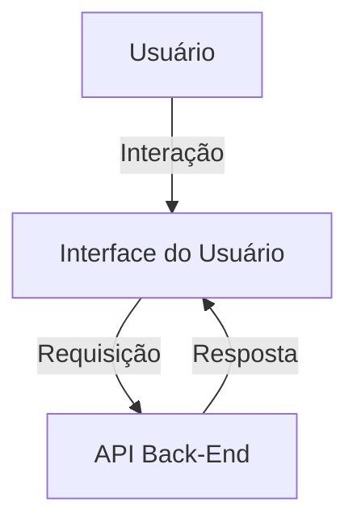
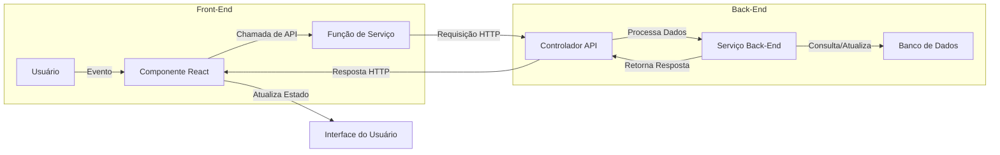
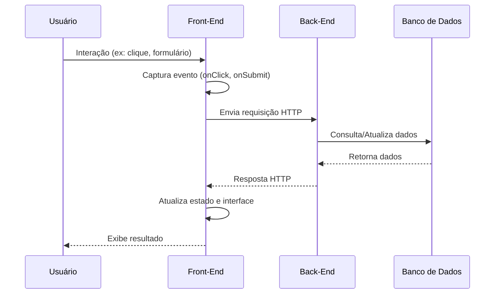
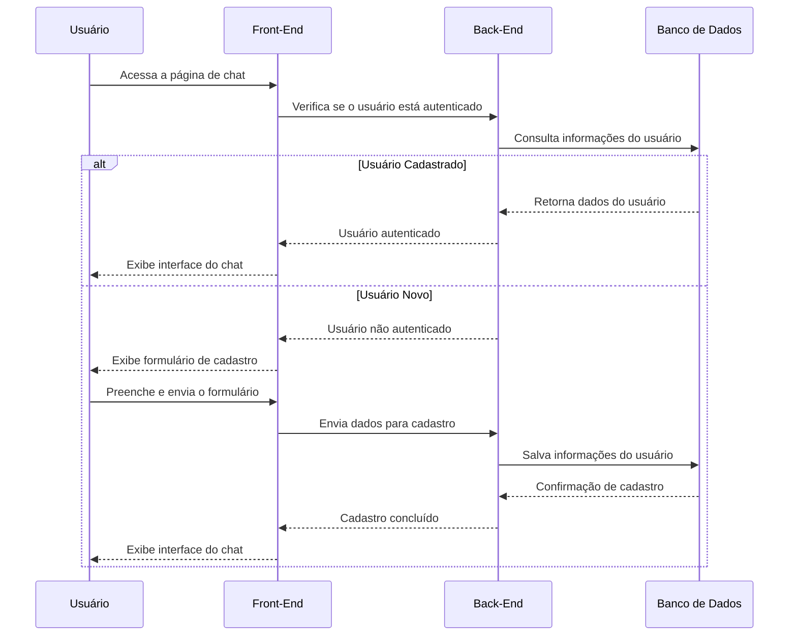
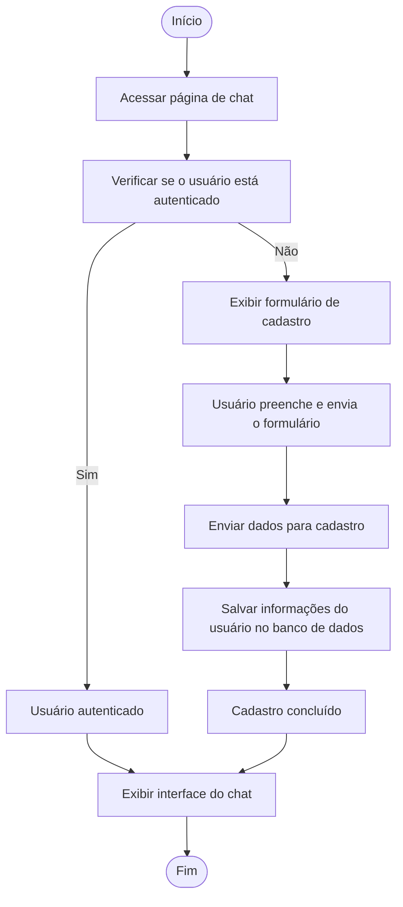

# Documentação do Front-End

## Introdução

Este documento descreve a construção e o funcionamento do front-end do projeto, detalhando as tecnologias utilizadas, as decisões arquiteturais e as abordagens adotadas. O objetivo é fornecer uma visão clara e abrangente do front-end para desenvolvedores e stakeholders.

---

## Arquitetura do Front-End

O front-end foi desenvolvido utilizando o framework **Next.js**, que é baseado em React. A escolha do Next.js foi motivada pelos seguintes fatores:

- **Renderização Híbrida**: Suporte a renderização estática e server-side rendering (SSR), otimizando o desempenho e a experiência do usuário. Isso permite que páginas sejam carregadas rapidamente e indexadas de forma eficiente por mecanismos de busca.
- **Roteamento Automático**: Simplificação do gerenciamento de rotas, eliminando a necessidade de configuração manual de arquivos de roteamento. Cada arquivo na pasta `pages` do Next.js é automaticamente tratado como uma rota.
- **Ecosistema Rico**: Integração com ferramentas modernas como Tailwind CSS para estilização e TypeScript para tipagem estática, garantindo um desenvolvimento mais rápido e seguro.

### Estrutura de Pastas

A estrutura do front-end está organizada da seguinte forma:

```plaintext
chatbot-f1/
├── public/          # Arquivos estáticos (imagens, ícones, etc.)
├── scripts/         # Scripts utilitários
├── src/
│   ├── app/         # Configuração de rotas e páginas
│   ├── components/  # Componentes reutilizáveis
│   ├── hooks/       # Hooks customizados
│   ├── lib/         # Funções utilitárias
│   ├── store/       # Gerenciamento de estado
│   ├── styles/      # Estilos globais e específicos
```

- **`public/`**: Contém recursos estáticos que podem ser acessados diretamente via URL. Exemplos incluem imagens, ícones e arquivos SVG.
- **`scripts/`**: Scripts utilitários para automação de tarefas, como inicialização do ambiente de desenvolvimento.
- **`src/`**: Diretório principal do código-fonte, dividido em subpastas para organização modular.
  - **`app/`**: Gerencia as rotas e páginas do projeto, aproveitando o sistema de roteamento do Next.js.
  - **`components/`**: Contém componentes reutilizáveis, como botões, cabeçalhos e formulários.
  - **`hooks/`**: Implementa hooks customizados para encapsular lógica reutilizável, como manipulação de estado ou chamadas de API.
  - **`lib/`**: Funções utilitárias que não se enquadram em outras categorias, como formatação de datas ou manipulação de strings.
  - **`store/`**: Gerencia o estado global da aplicação utilizando o Context API.
  - **`styles/`**: Contém arquivos de estilização, incluindo configurações globais e específicas de componentes.

---

## Tecnologias Utilizadas

### **Next.js**

Framework React para renderização híbrida e otimização de desempenho. Ele oferece suporte nativo para geração de páginas estáticas (SSG) e renderização no lado do servidor (SSR), permitindo que o desenvolvedor escolha a melhor abordagem para cada página.

- **SSG (Static Site Generation)**: Ideal para páginas que não mudam frequentemente, como landing pages.
- **SSR (Server-Side Rendering)**: Utilizado para páginas dinâmicas que dependem de dados atualizados em tempo real.
- **API Routes**: Permite criar endpoints de API diretamente no front-end, eliminando a necessidade de um servidor separado para lógica simples.

### **TypeScript**

Adotado para tipagem estática, reduzindo erros e melhorando a manutenção do código. Com TypeScript, é possível:

- Detectar erros em tempo de desenvolvimento, antes mesmo de executar o código.
- Garantir que funções e componentes sejam utilizados corretamente, respeitando os tipos esperados.
- Facilitar a refatoração, já que o editor pode identificar automaticamente onde mudanças precisam ser feitas.

### **Tailwind CSS**

Utilizado para estilização, permitindo um design responsivo e consistente com classes utilitárias. O Tailwind CSS oferece:

- **Classes Utilitárias**: Como `flex`, `grid`, `text-center`, que eliminam a necessidade de escrever CSS personalizado para estilos comuns.
- **Customização**: Configuração fácil para ajustar temas, cores e espaçamentos de acordo com as necessidades do projeto.
- **Desempenho**: Geração de CSS otimizado, removendo classes não utilizadas em produção.

### **Gerenciamento de Estado**

Foi utilizado o **Context API** do React para gerenciamento de estado global, garantindo simplicidade e eficiência. O Context API é ideal para:

- Compartilhar dados entre componentes sem a necessidade de "prop drilling".
- Gerenciar estados globais, como autenticação do usuário e configurações de tema.
- Integrar facilmente com hooks customizados para encapsular lógica complexa.

---

## Fluxo de Funcionamento

### Diagrama de Fluxo



### Explicação do Fluxo

1. **Interação do Usuário**:
   - O usuário interage com a interface do front-end, como clicar em botões, preencher formulários ou navegar entre páginas.
   - Essas interações são capturadas por eventos no React, como `onClick` ou `onSubmit`.

2. **Envio de Requisição**:
   - O front-end utiliza bibliotecas como `fetch` ou `axios` para enviar requisições HTTP ao back-end.
   - As requisições podem incluir dados do usuário, como informações de formulários ou parâmetros de consulta.

3. **Processamento no Back-End**:
   - O back-end processa a requisição, acessa o banco de dados ou executa lógica de negócios e retorna uma resposta.

4. **Atualização da Interface**:
   - O front-end recebe a resposta do back-end e atualiza a interface dinamicamente.
   - Por exemplo, exibe dados retornados ou mensagens de erro, utilizando o estado do React para refletir as mudanças.

### Gráfico Detalhado



### Explicação do Gráfico

- **Front-End**:
  - O usuário interage com componentes React, que disparam eventos e chamam funções de serviço para realizar requisições ao back-end.
  - Após receber a resposta, o estado do React é atualizado, refletindo as mudanças na interface.

- **Back-End**:
  - O controlador API recebe a requisição e delega o processamento para serviços específicos.
  - Os serviços acessam o banco de dados para buscar ou atualizar informações e retornam uma resposta ao front-end.

Esse fluxo garante uma comunicação eficiente entre o front-end e o back-end, proporcionando uma experiência de usuário fluida e responsiva.

---

## Decisões de Design

### **Componentização**

Os componentes foram projetados para serem reutilizáveis e modulares, seguindo o princípio DRY (Don't Repeat Yourself). Exemplos incluem:

- **Botões**: Componentes genéricos que aceitam propriedades como `onClick` e `style`.
- **Formulários**: Componentes que encapsulam validação e envio de dados.
- **Modais**: Componentes reutilizáveis para exibição de mensagens ou formulários em sobreposição.

### **Estilização**

A escolha do Tailwind CSS foi feita para acelerar o desenvolvimento e garantir consistência visual. Além disso:

- Foram definidos temas personalizados para cores e fontes, garantindo alinhamento com a identidade visual do projeto.
- Classes utilitárias foram combinadas com estilos específicos para atender a requisitos únicos de design.

### **Acessibilidade**

Foram seguidas boas práticas de acessibilidade (WCAG) para garantir que o sistema seja utilizável por todos. Isso inclui:

- Uso de atributos ARIA para melhorar a navegação por leitores de tela.
- Garantia de contraste adequado entre texto e fundo.
- Navegação por teclado para todos os elementos interativos.

---

## Tabelas de Referência

### Principais Dependências

| Dependência     | Versão   | Descrição                          |
|-----------------|----------|------------------------------------|
| Next.js         | 13.x     | Framework React para SSR e SSG    |
| React           | 18.x     | Biblioteca para construção de UIs |
| Tailwind CSS    | 3.x      | Framework de estilização utilitária|
| TypeScript      | 5.x      | Superset do JavaScript            |

---

## Conclusão

O front-end foi projetado para ser escalável, eficiente e fácil de manter. As tecnologias e abordagens escolhidas garantem uma experiência de usuário otimizada e um desenvolvimento ágil.

Para dúvidas ou contribuições, consulte a equipe de desenvolvimento.

---

## Diagramas UML

### Diagrama de Atividade

O diagrama de atividade abaixo ilustra o fluxo de interação do usuário com o front-end e a comunicação com o back-end:

```mermaid
activityDiagram
start
:Usuário interage com a interface;
if (Evento capturado?) then (Sim)
  :Disparar evento no React;
  :Chamar função de serviço;
  :Enviar requisição HTTP ao back-end;
  if (Resposta recebida?) then (Sim)
    :Atualizar estado do React;
    :Renderizar interface atualizada;
  else (Não)
    :Exibir mensagem de erro;
  endif
else (Não)
  :Aguardar nova interação;
endif
stop
```

### Diagrama de Sequência

O diagrama de sequência abaixo detalha a interação entre o usuário, o front-end e o back-end:



### Diagrama de Sequência: Acesso ao Chat

O diagrama abaixo ilustra o fluxo de interação do usuário ao acessar o chat, considerando os cenários de usuário novo e usuário cadastrado:



### Diagrama de Atividade: Acesso ao Chat

O diagrama abaixo representa o fluxo de atividades para o acesso ao chat, considerando os cenários de usuário novo e usuário cadastrado:



### Explicação dos Diagramas

- **Diagrama de Atividade**:
  - Representa o fluxo de ações desde a interação do usuário até a atualização da interface.
  - Inclui decisões condicionais, como o tratamento de erros em caso de falha na requisição.

- **Diagrama de Sequência**:
  - Mostra a ordem cronológica das interações entre os participantes (usuário, front-end, back-end e banco de dados).
  - Detalha como os dados fluem entre os componentes do sistema, desde a entrada do usuário até a exibição do resultado.

---

## Comunicação com SignalR

O **SignalR** é utilizado no front-end para estabelecer uma comunicação em tempo real com o back-end. Ele permite que mensagens sejam enviadas e recebidas instantaneamente, sem a necessidade de atualizações manuais da página.

### Como Funciona

1. **Conexão**: O front-end inicia uma conexão com o servidor SignalR utilizando uma biblioteca cliente.
2. **Subscrição**: O cliente subscreve a eventos específicos, como mensagens de chat ou notificações.
3. **Envio de Mensagens**: O cliente pode enviar mensagens ao servidor, que as processa e as distribui para outros clientes conectados.
4. **Recebimento de Mensagens**: O cliente recebe mensagens do servidor e atualiza a interface do usuário em tempo real.

### Benefícios

- **Baixa Latência**: Atualizações quase instantâneas entre cliente e servidor.
- **Escalabilidade**: Suporte para múltiplos clientes conectados simultaneamente.
- **Flexibilidade**: Suporte para diferentes transportes, como WebSockets, Server-Sent Events e Long Polling.

### Exemplo de Uso

No contexto do chat, o SignalR é utilizado para:

- Notificar todos os participantes quando uma nova mensagem é enviada.
- Atualizar a lista de usuários online em tempo real.
- Exibir alertas ou eventos importantes sem recarregar a página.

---
