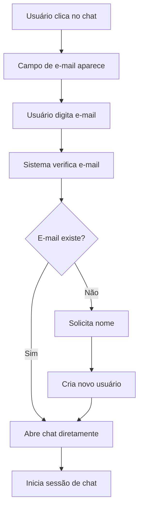

# ChatBot F1 - Frontend

Um chatbot inteligente desenvolvido em Next.js 14 com TypeScript, integrado com backend .NET 9 e comunicação em tempo real via SignalR.

## 📋 Índice

- [Sobre o Projeto](#sobre-o-projeto)
- [Funcionalidades](#funcionalidades)
- [Pré-requisitos](#pré-requisitos)
- [Instalação](#instalação)
- [Configuração](#configuração)
- [Como Usar](#como-usar)
- [Estrutura do Projeto](#estrutura-do-projeto)
- [API Endpoints](#api-endpoints)
- [Tecnologias](#tecnologias)
- [Troubleshooting](#troubleshooting)
- [Scripts Disponíveis](#scripts-disponíveis)

## 🎯 Sobre o Projeto

O ChatBot F1 é uma aplicação de chat em tempo real que permite:
- Autenticação simples por e-mail
- Cadastro automático de novos usuários
- Conversas inteligentes com bot automatizado
- Interface responsiva e moderna
- Comunicação bidirecional em tempo real

## ✨ Funcionalidades

### 🔐 Autenticação
- ✅ Login por e-mail (sem senha)
- ✅ Registro automático para novos usuários
- ✅ Persistência de sessão no navegador
- ✅ Logout com comando "sair"

### 💬 Chat
- ✅ Interface de chat moderna e responsiva
- ✅ Mensagens em tempo real via SignalR
- ✅ Respostas automáticas do bot
- ✅ Histórico de mensagens da sessão
- ✅ Indicadores visuais (timestamps, status)
- ✅ Suporte a dispositivos móveis

### 🤖 Bot Inteligente
- ✅ Processamento automático de mensagens
- ✅ Respostas contextuais
- ✅ Integração com backend .NET
- ✅ Comando especial "sair" para encerrar sessão

## 📋 Pré-requisitos

Antes de iniciar, certifique-se de ter instalado:

### Software Necessário
- **Node.js** versão 18.0.0 ou superior
  - [Download Node.js](https://nodejs.org/)
  - Verificar versão: `node --version`
- **npm** versão 8.0.0 ou superior (incluso com Node.js)
  - Verificar versão: `npm --version`
- **Git** (para clonar o repositório)
  - [Download Git](https://git-scm.com/)

### Backend Dependente
- **Backend .NET 9** rodando em `https://localhost:5001`
- **SQL Server** ou banco compatível (configurado no backend)

## 🚀 Instalação

### 1. Clonar o Repositório
```bash
git clone <url-do-repositorio>
cd chatbot-f1
```

### 2. Instalar Dependências
```bash
# Usar npm
npm install

# Ou usar yarn (se preferir)
yarn install

# Ou usar pnpm (se preferir)
pnpm install
```

### 3. Verificar Instalação
```bash
# Verificar se todas as dependências foram instaladas
npm list --depth=0
```

## ⚙️ Configuração

### 1. Variáveis de Ambiente

Crie o arquivo `.env.local` na raiz do projeto:

```bash
# APIs do Backend
NEXT_PUBLIC_API_BASE_URL=https://localhost:5001/api
NEXT_PUBLIC_SIGNALR_HUB_URL=https://localhost:5001/chathub

# Configuração para desenvolvimento (ignore certificados SSL)
NODE_TLS_REJECT_UNAUTHORIZED=0
```

### 2. Configurações do Projeto

O projeto já vem pré-configurado com:
- **Tailwind CSS** para estilização
- **Redux Toolkit** para gerenciamento de estado
- **Axios** configurado para APIs
- **SignalR** para comunicação em tempo real
- **shadcn/ui** para componentes de interface

### 3. Configuração do Backend

Certifique-se de que o backend .NET está configurado para:
- Aceitar requisições CORS de `http://localhost:3000`
- Executar em `https://localhost:5001`
- Ter SignalR configurado no endpoint `/chathub`

## 🎮 Como Usar

### 1. Iniciar o Backend
```bash
# Navegue até o diretório do backend
cd ../Backend  # ou caminho do seu backend

# Inicie o backend .NET
dotnet run
```

### 2. Iniciar o Frontend
```bash
# No diretório do frontend
npm run dev
```

### 3. Acessar a Aplicação
- Abra o navegador em: `http://localhost:3000`
- O chatbot aparecerá como um botão flutuante no canto inferior direito

### 4. Fluxo de Uso

#### Primeiro Acesso:
1. **Clique no botão do chat** (ícone de mensagem)
2. **Digite seu e-mail** no campo solicitado
3. **Se e-mail não existir**: Sistema pedirá seu nome para cadastro
4. **Se e-mail existir**: Chat abrirá diretamente
5. **Comece a conversar** com o bot

#### Conversa:
1. **Digite mensagens** no campo de texto
2. **Pressione Enter** ou clique no botão enviar
3. **Bot responderá automaticamente**
4. **Digite "sair"** para encerrar a sessão

#### Comandos Especiais:
- `sair` - Encerra a sessão e fecha o chat
- Qualquer outra mensagem será processada pelo bot

#### Comandos Especiais:
- `sair` - Encerra a sessão e fecha o chat
- Qualquer outra mensagem será processada pelo bot

## 📁 Estrutura do Projeto

```
chatbot-f1/
├── public/                     # Arquivos estáticos
│   ├── image/
│   │   ├── chat-icon.png       # Ícone do chat
│   │   └── f1-logo.png         # Logo F1
│   ├── next.svg
│   └── vercel.svg
├── scripts/                    # Scripts utilitários
│   ├── check-backend.js        # Verificação do backend
│   └── dev-with-browser.js     # Desenvolvimento com browser
├── src/
│   ├── app/                    # App Router do Next.js 14
│   │   ├── contact/
│   │   │   └── page.tsx        # Página de contato
│   │   ├── globals.css         # Estilos globais
│   │   ├── layout.tsx          # Layout principal
│   │   ├── page.tsx            # Página inicial
│   │   └── providers.tsx       # Providers (Redux, etc.)
│   ├── components/
│   │   ├── ui/                 # Componentes shadcn/ui
│   │   │   ├── button.tsx
│   │   │   ├── dialog.tsx
│   │   │   └── input.tsx
│   │   ├── ChatWidget.tsx      # Componente principal do chat
│   │   ├── ClientLayout.tsx    # Layout do cliente
│   │   ├── ErrorBoundary.tsx   # Tratamento de erros
│   │   ├── Footer.tsx          # Rodapé
│   │   └── Navbar.tsx          # Barra de navegação
│   ├── hooks/
│   │   └── useDevWarnings.ts   # Hook para warnings de dev
│   ├── lib/
│   │   ├── api.ts              # Cliente Axios configurado
│   │   ├── signalr.ts          # Configuração SignalR
│   │   └── utils.ts            # Utilitários gerais
│   ├── store/
│   │   └── store.ts            # Estado global Redux Toolkit
│   ├── styles/
│   │   └── chat-widget.css     # Estilos específicos do chat
│   └── types/                  # Definições TypeScript
├── .env.local                  # Variáveis de ambiente
├── .gitignore                  # Arquivos ignorados pelo Git
├── components.json             # Configuração shadcn/ui
├── next.config.js              # Configuração do Next.js
├── package.json                # Dependências e scripts
├── postcss.config.js           # Configuração PostCSS
├── README.md                   # Este arquivo
├── tailwind.config.js          # Configuração Tailwind
└── tsconfig.json               # Configuração TypeScript
```

## 🔌 API Endpoints

### Autenticação

```http
GET /api/Users/by-email?email={email}
# Busca usuário existente por e-mail
# Retorna: 200 (usuário) ou 404 (não encontrado)

POST /api/Users
# Cria novo usuário
# Body: { "name": "string", "email": "string" }
# Retorna: 201 com dados do usuário criado
```

### Chat

```http
POST /api/Chat/start-session
# Inicia nova sessão de chat
# Body: { "userId": "string", "userName": "string", "initialMessageContent": "string" }
# Retorna: 200 com dados da sessão

GET /api/Chat/active-session?userId={userId}
# Busca sessão ativa do usuário
# Retorna: 200 (sessão ativa) ou 404 (sem sessão)

POST /api/Chat/send-message
# Envia mensagem no chat
# Body: { "chatSessionId": "string", "userId": "string", "content": "string" }
# Retorna: 200 com dados da mensagem

POST /api/Chat/end-session
# Encerra sessão de chat
# Body: { "chatSessionId": "string", "userId": "string" }
# Retorna: 200 (sucesso)
```

### Bot

```http
POST /api/Bot/process-message
# Processa mensagem e gera resposta do bot
# Body: { "chatSessionId": "string", "messageContent": "string" }
# Retorna: 200 com resposta do bot
```

## 🛠️ Tecnologias

### Frontend

- **Next.js 14** - Framework React com App Router
- **TypeScript** - Tipagem estática
- **React 18** - Biblioteca de interface
- **Tailwind CSS** - Framework de CSS utilitário
- **shadcn/ui** - Componentes de interface pré-construídos

### Estado e Dados

- **Redux Toolkit** - Gerenciamento de estado global
- **Axios** - Cliente HTTP para APIs
- **React Hooks** - Gerenciamento de estado local

### Comunicação

- **SignalR Client** - Comunicação em tempo real
- **WebSockets** - Protocolo de comunicação bidirecional

### Desenvolvimento

- **ESLint** - Linting de código
- **PostCSS** - Processamento de CSS
- **TypeScript Compiler** - Compilação TypeScript

## 🔧 Scripts Disponíveis

```bash
# Desenvolvimento
npm run dev          # Inicia servidor de desenvolvimento
npm run build        # Cria build de produção
npm run start        # Inicia servidor de produção
npm run lint         # Executa linting do código

# Scripts personalizados
npm run dev:browser  # Inicia dev e abre navegador automaticamente
npm run check:backend # Verifica se backend está rodando
```

## 🐛 Troubleshooting

### Problemas Comuns

#### 1. Erro "Cannot connect to backend"

```bash
# Verificar se backend está rodando
curl https://localhost:5001/api/health

# Ou usar o script de verificação
npm run check:backend
```

#### 2. Erro de CORS

- Verifique se o backend aceita requisições de `http://localhost:3000`
- Configure CORS no backend .NET:

```csharp
builder.Services.AddCors(options =>
{
    options.AddPolicy("AllowFrontend", policy =>
    {
        policy.WithOrigins("http://localhost:3000")
              .AllowAnyHeader()
              .AllowAnyMethod()
              .AllowCredentials();
    });
});
```

#### 3. Erro de SSL/Certificado

- O `.env.local` tem `NODE_TLS_REJECT_UNAUTHORIZED=0` para desenvolvimento
- Em produção, configure certificados SSL válidos

#### 4. SignalR não conecta

```bash
# Verificar endpoint SignalR
curl https://localhost:5001/chathub

# Verificar logs do navegador (F12 -> Console)
# Procurar por erros relacionados a WebSocket
```

#### 5. Dependências desatualizadas

```bash
# Verificar dependências desatualizadas
npm outdated

# Atualizar dependências
npm update

# Reinstalar node_modules se necessário
rm -rf node_modules package-lock.json
npm install
```

#### 6. Problemas de Performance

```bash
# Limpar cache do Next.js
rm -rf .next

# Verificar bundle size
npm run build
```

### Logs e Debugging

#### Ativar logs detalhados:

1. Abra **DevTools** (F12)
2. Vá para aba **Console**
3. Veja logs detalhados das operações
4. Verifique aba **Network** para requisições HTTP

#### Logs do SignalR:

```typescript
// No arquivo signalr.ts
const connection = new HubConnectionBuilder()
    .withUrl(hubUrl)
    .configureLogging(LogLevel.Debug) // Ativar logs detalhados
    .build();
```

### Fluxo de Funcionamento Detalhado

#### 1. Inicialização da Aplicação

1. **Carregamento**: Next.js carrega a página inicial
2. **Redux Store**: Estado global é inicializado
3. **Chat Widget**: Componente é renderizado como botão flutuante
4. **Verificação de Sessão**: Sistema verifica se há usuário logado

#### 2. Processo de Autenticação



#### 3. Comunicação em Tempo Real

1. **Conexão SignalR**: Estabelecida automaticamente
2. **Envio de Mensagem**: 
   - Frontend envia via API REST
   - Backend processa e responde
   - Resposta é enviada via SignalR
3. **Recebimento**: Widget recebe e exibe mensagens instantaneamente

#### 4. Comandos Especiais

- **"sair"**: Encerra sessão, desconecta SignalR, limpa estado
- **Outras mensagens**: Processadas pelo bot via API

### Suporte

Se os problemas persistirem:

1. Verifique se todas as dependências estão instaladas
2. Confirme que o backend está rodando corretamente
3. Verifique os logs do console do navegador
4. Teste com diferentes navegadores
5. Verifique se não há conflitos de porta

## 📞 Contato

Para dúvidas ou suporte:

- **E-mail**: vladimirca2000@gmail.com
- **WhatsApp**: [+55 (35) 92001-4611](https://wa.me/+5535920014611)
- **LinkedIn**: [linkedin.com/in/vladimirca2000](https://linkedin.com/in/vladimirca2000)
- **GitHub**: [github.com/vladimirca2000](https://github.com/vladimirca2000)

---

**Desenvolvido com Next.js 14 e TypeScript**
